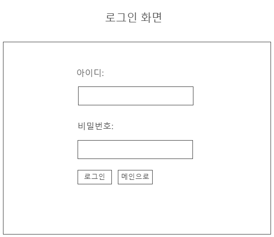
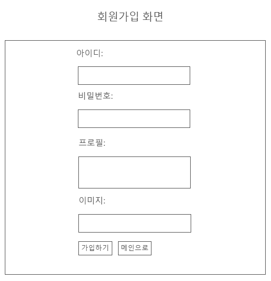
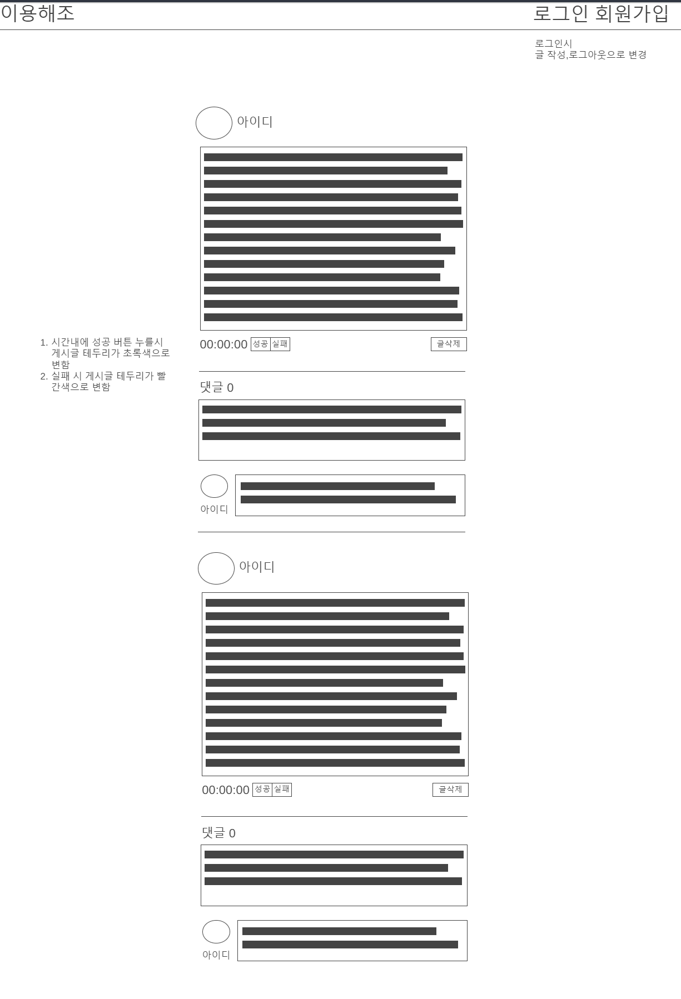
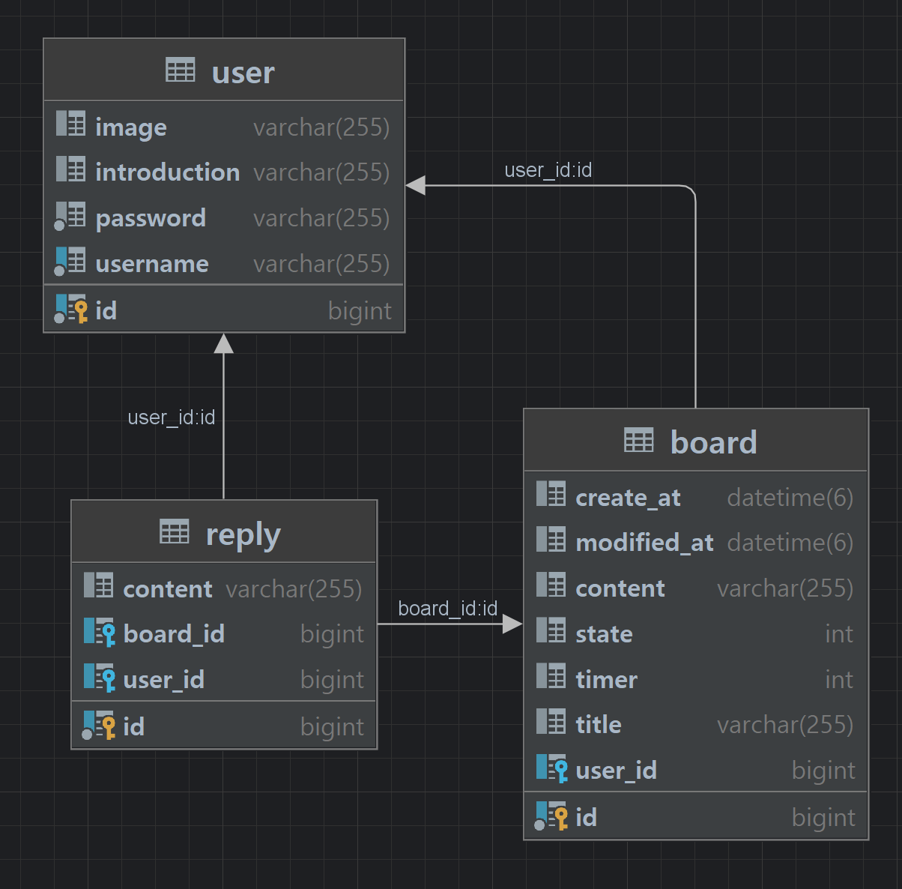
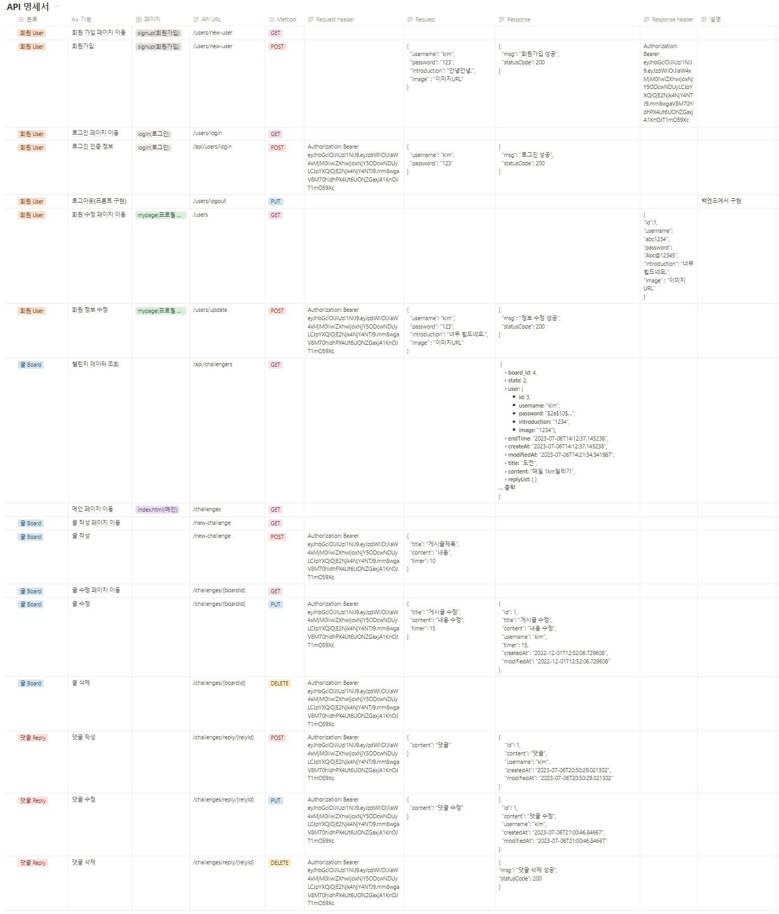

# 이용해조 ❓
목표를 공유하고 함께 응원하는 챌린지 웹 서비스입니다.\
[꽃길조 Notion 바로가기](https://www.notion.so/verdureko/f9172a6d8c4e44e7a27c4fefb9a0b8cc)

<!-- TABLE OF CONTENTS -->
<details id="top">
  <summary>Index</summary>
  <ol>
    <li>
      <a href="#실행">실행</a>
      <a href="#built-with">Built with</a>
    </li>
    <li>
      <a href="#기획">기획</a>
      <ul>
        <li><a href="#api-명세서">Api 명세서</a></li>
        <li><a href="#erd">ERD</a></li>
        <li><a href="#package-구조">Package 구조</a></li>
      </ul>
    </li>
    <li><a href="#contributors">Contributors</a></li>
    <li><a href="#contributing">Contributing</a></li>
    <li><a href="#acknowledgments">Acknowledgments</a></li>
  </ol>
</details>

## Built with

<b>OS</b>

<a href="https://www.microsoft.com/ko-kr/software-download/windows10%5C"></a>
<a href="https://support.apple.com/ko_KR/downloads/macos"></a>

<b>Tools</b>

<a href="https://www.jetbrains.com/ko-kr/idea/download/?section=windows"></a>
<a href="https://docs.gradle.org/current/userguide/what_is_gradle.html"></a>
<br/>
<a href="https://git-scm.com/">
<a href="https://github.com/"></a>

<b>Backend</b>

<a href="https://adoptium.net/temurin/releases/"></a>
<br/>
<a href="https://spring.io/projects/spring-boot"></a>
<a href="https://spring.io/projects/spring-data-jpa"></a>
<a href="https://spring.io/projects/spring-security"></a>
<br/>
<a href="https://spring.io/guides/gs/validating-form-input/"></a>
<a href="https://projectlombok.org/setup/gradle"></a>
<!--  -->
<a href="https://jwt.io/"></a>
<br/>
<a href="https://www.mysql.com/"></a>

<b>Frontend</b>

<a href="https://ko.wikipedia.org/wiki/HTML"></a>
<a href="https://ko.wikipedia.org/wiki/%EC%9E%90%EB%B0%94%EC%8A%A4%ED%81%AC%EB%A6%BD%ED%8A%B8"></a>
<a href="https://ko.wikipedia.org/wiki/CSS"></a>
<br/>
<a href="https://getbootstrap.com/"></a>
<a href="https://fontawesome.com/"></a>

---

## 실행
1. `application.properties` 
   - DB 비밀번호 설정
2. `build.gradle`
   - 코끼리 때리기
3. `JpaSaveTest.java`
   - 테스트 실행해 dummy_data 생성
4. 실행
   - 브라우저에 서버주소:포트번호

## 기획

### 기능
1. 뉴스 피드(메인) 기능
2. 타이머 기능
3. 사용자 인증
    - 회원가입
    - 로그인 및 로그아웃
    - 프로필 수정
4. 게시물 CRUD 기능
5. 댓글 CRUD 기능
6. 화면 구현

## 와이어프레임
[wireFrame 바로가기](https://wireframe.cc/bC7S3J)
<!--



-->
## ERD


## API 명세서
[API 바로가기](https://www.notion.so/verdureko/f9172a6d8c4e44e7a27c4fefb9a0b8cc)
<!--

-->
## Package 구조

```txt
└── src
    ├── main
    │   ├── java
    │   │   └── com.sparta.wish 
    │   │       ├── config
    │   │       │   ├── PasswordConfig.java
    │   │       │   └── WebSecurityConfig.java
    │   │       ├── controller
    │   │       │   ├── BoardController.java
    │   │       │   ├── HomeController.java
    │   │       │   ├── ReplyController.java
    │   │       │   └── UserController.java
    │   │       ├── dto
    │   │       │   ├── User
    │   │       │   │   ├── LoginRequestDto.java
    │   │       │   │   ├── SignupRequestDto.java
    │   │       │   │   ├── UserProfileRequestDto.java
    │   │       │   │   └── UserProfileResponseDto.java
    │   │       │   ├── ApiResult.java
    │   │       │   ├── BoardRequestDto.java
    │   │       │   ├── BoardResponseDto.java
    │   │       │   ├── ReplyRequestDto.java
    │   │       │   └── ReplyResponseDto.java
    │   │       ├── entity
    │   │       │   ├── Board.java
    │   │       │   ├── Reply.java
    │   │       │   ├── Timestamped.java
    │   │       │   └── User.java
    │   │       ├── jwtUtil
    │   │       │   ├── JwtAuthenticationFilter.java
    │   │       │   ├── JwtAuthorizationFilter.java
    │   │       │   └── JwtUtil.java
    │   │       ├── repository
    │   │       │   ├── BoardRepository.java
    │   │       │   ├── ReplyRepository.java
    │   │       │   └── UserRepository.java   
    │   │       ├── security
    │   │       │   ├── UserDetailsImpl.java
    │   │       │   └── UserDetailsServiceImpl.java
    │   │       ├── service
    │   │       │   ├── BoardService.java
    │   │       │   ├── ReplyService.java
    │   │       │   └── UserService.java
    │   │       └── WishApplication.java
    │   └── resources
    │       ├── static
    │       │   ├── css
    │       │   │   └── style.css
    │       │   └── js
    │       │       └── script.js
    │       ├── templates
    │       │   ├── index.html
    │       │   ├── login.html
    │       │   ├── mypage.html
    │       │   ├── newboard.html
    │       │   ├── mypage.html
    │       │   ├── signup.html
    │       │   └── updateboard.html
    │       └── sql
    │           ├── users.sql
    │           ├── boards.sql
    │           └── replies.sql
    └── test
        └── java
            └── com.sparta.wish
                   └── JpaSaveTest.java

```

## Contributors
<table>
  <tr>
    <td align="center">
      <a href="https://github.com/yuio7279">
        <br />
        <sub><b>Ye-sung Kim</b></sub></a><br />
        <a href="https://github.com/yuio7279" title="Code">💻</a>
    </td>
    <td align="center">
      <a href="https://github.com/junyoung4949">
        <br />
        <sub><b>Jun-young Kim</b></sub></a><br />
        <a href="https://github.com/junyoung4949" title="Code">💻</a>
    </td>
    <td align="center">
      <a href="https://github.com/Junhui0u0">
        <br />
        <sub><b>Jang-won Kim</b></sub></a><br />
        <a href="https://github.com/Junhui0u0" title="Code">💻</a>
    </td>
    <td align="center">
      <a href="https://github.com/Junhui0u0">
        <br />
        <sub><b>Dong-gyu Kim</b></sub></a><br />
        <a href="https://github.com/Junhui0u0" title="Code">💻</a>
    </td>
    <td align="center">
      <a href="https://github.com/Junhui0u0">
        <br />
        <sub><b>Pu-reum Ko</b></sub></a><br />
        <a href="https://github.com/Junhui0u0" title="Code">💻</a>
    </td>
  </tr>
</table>  

## Contributing
**Contributions** 은 오픈 소스 커뮤니티를 배우고, 영감을 주고, 창조할 수 있는 놀라운 장소로 만드는 것입니다.

프로젝트를 개선하기 위한 제안이 있는 경우 저장소를 포크하고 풀 요청을 작성하십시오. "enhancement" 태그를 사용하여 이슈를 열 수도 있습니다.

1. Fork the Project
2. Create your Feature Branch
3. Commit your Changes
4. Push to the Branch
5. Open a Pull Request

## Acknowledgments
이 공간에 유용하다고 생각하고 공로를 인정하고 싶은 리소스를 나열해주세요. 
우리는 일을 시작하기 위해 유용한 몇 가지를 포함했습니다!

- [토스트 UI 코딩 컨벤션](https://ui.toast.com/fe-guide/ko_CODING-CONVENTION)
- [MySQL 예약어](https://zetawiki.com/wiki/MySQL_%EC%98%88%EC%95%BD%EC%96%B4)
- [Udacity Git Commit Message Style Guide](https://udacity.github.io/git-styleguide/)

- [Image Shields](https://shields.io)
- [Simple Icon](https://simpleicons.org/)
- [GitHub Emoji Cheat Sheet](https://www.webpagefx.com/tools/emoji-cheat-sheet)
- [Font Awesome](https://fontawesome.com)
- [Boot Strap](https://getbootstrap.com/)

<p align="right">(<a href="#top">back to top</a>)</p>